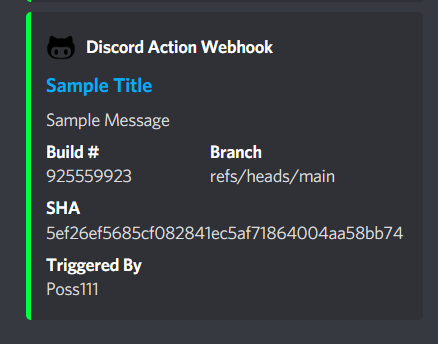

# Discord Webhook Action

***Author***        : [Poss111](https://github.com/Poss111)

***Latest Version***: v1.6.11 [](https://github.com/Poss111/discord-hook-action/actions/workflows/main.yml)

## Table of Contents
- [Inputs](#Inputs)  
- [Outputs](#Outputs)   
- [Usage](#Usage)   
- [Discord Message Example](#discord-message-example)   
- [Final Notes](#final-notes)

## Inputs

<a id="Inputs"></a>

This is a simple discord hook action to send a message to your discord server upon building for real time notifications of build status.

| Inputs | Optional | Description |
| -------- | ----------- | ------ |
| discord-hook-url | No | The webhook url created for your discord server to post your expected message to |
| title | Yes | Title to be given to your embedded message |
| message | Yes | Message to be given with embedded message |
| message-color | Yes | Color to be given alongside embedded message |
| branch | Yes | The git branch for the build |
| sha | Yes | The sha of the git commit being built |
| buildNumber | Yes | The build number of the current action | 
| triggeredBy | Yes | Who has triggered this action |
| actionUrl | Yes | The link to the job being built |

## Outputs

<a id="Outputs"></a>

| Outputs | Description |
| -------- | ------ |
| successful | Was the message successfully sent |

## Usage

<a id="Usage"></a>

Here is a quick snippet to speed up integrating this into your workflow. ***NOTE***: Replace the discord-hook-url with your server's webhook url
```yaml
    steps:
      - name: Test Step for Discord Action
        id: discordAction
        uses: Poss111/discord-hook-action@v1.6.11
        with:
          discord-hook-url: 'https://replace/with/your/discord/webhook/url'
          title: 'Sample Title'
          message: 'Sample Message'
          message-color: '65345'
      - name: Was Job Successful
        run: echo "The job was successful ran > ${{ steps.discordAction.outputs.successful }}"
```


## Discord Message Example

<a id="discord-message-example"></a>

Here is a sample of what your message may look like once posted to your sever.



## Final Notes

<a id="final-notes"></a>

If you have any bugs or enhancements with the action, please post them along with the following details
For Bugs
1. A snippet of the failure output from the action

For Enhancements
1. Sample output for change (If you want to modify the format of the card, you can propose one from here and post it with the issue [Discord Embedded Message Generator](https://cog-creators.github.io/discord-embed-sandbox))


# Thank you all! I hope you enjoy this action and use it well! :D
